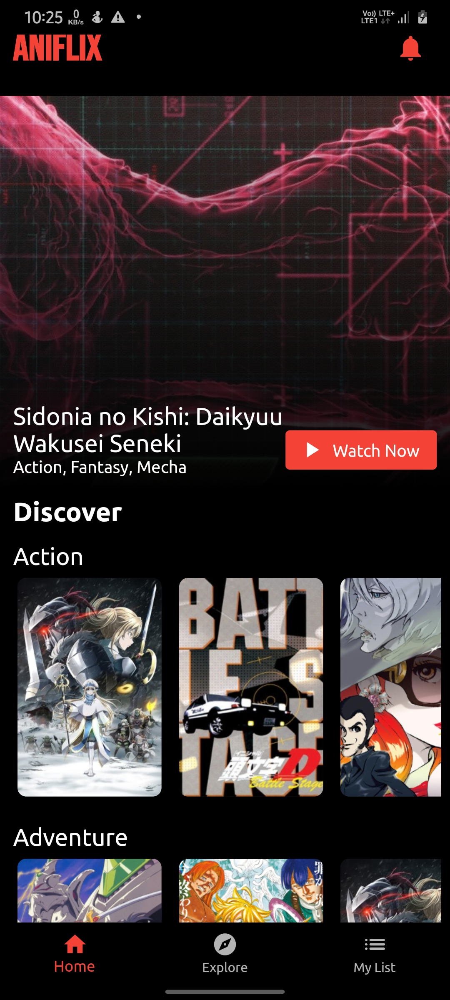
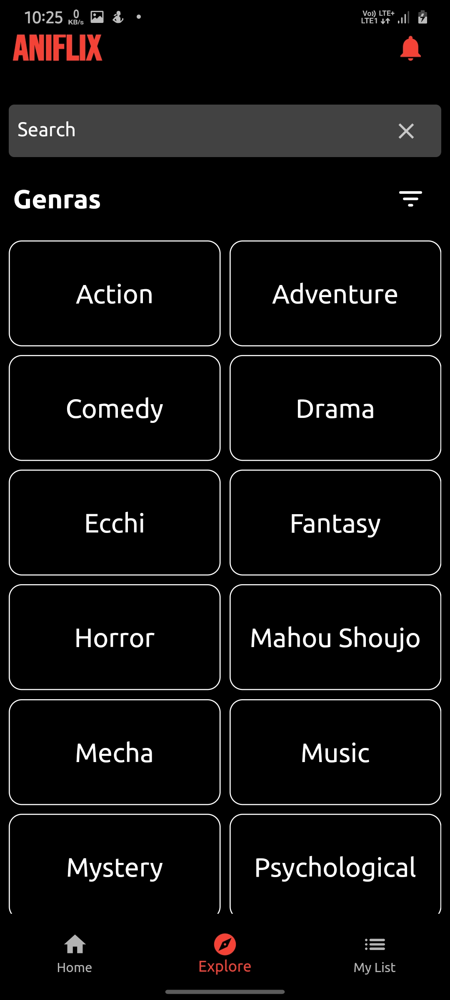
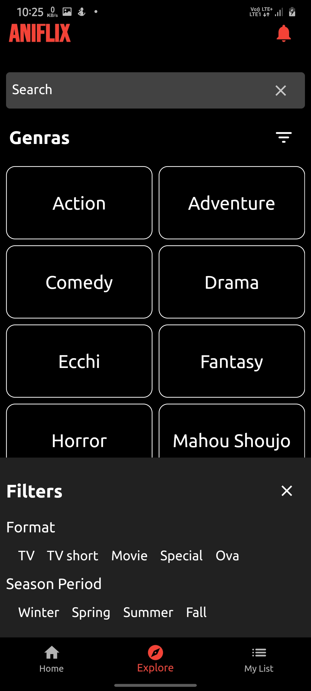
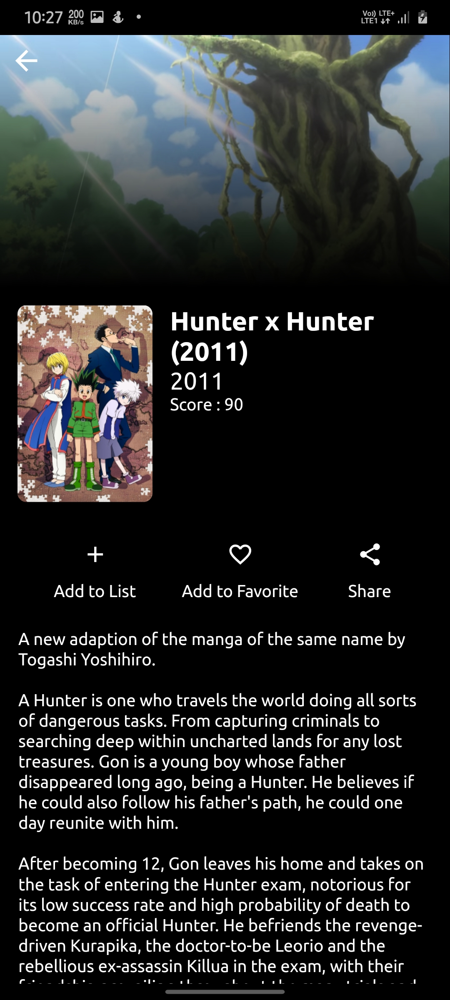
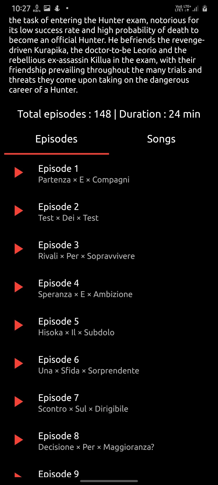
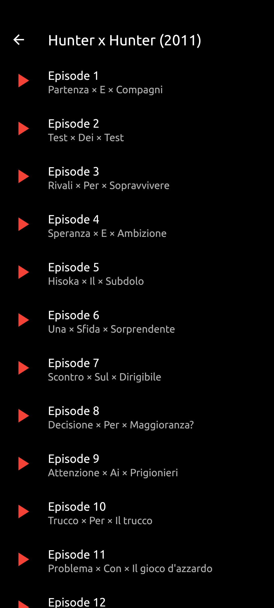
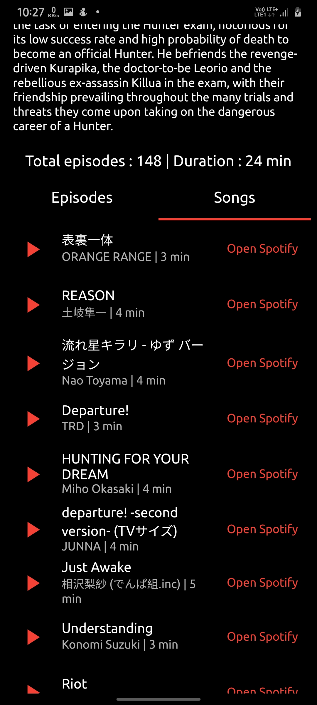
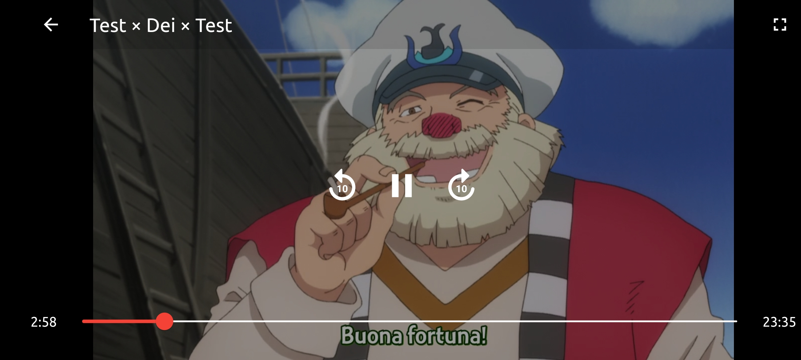

# Aniflix 

Netflix clone made with Flutter and [AniApi](https://www.aniapi.com) to explore and stream anime

 -> Flutter Providers are used for the statemanagement in the overall app.
 -> Pagination for implementing infinite scrolling and makeing user experience better.
 -> Hive box(Flutter NoSql database) is used to save the user related information in local storage.
 -> Flutter video player is used to stream anime episodes.
 -> Flutter audio player is used top play the demo audio clip and then user may switch to spotify to listen full song.
 -> Firebase anylatics is used to keep track of the user actions and make better future updates accordingly.

## Screenshots
 

This project is a starting point for a Flutter application.

A few resources to get you started if this is your first Flutter project:

- [Lab: Write your first Flutter app](https://flutter.dev/docs/get-started/codelab)
- [Cookbook: Useful Flutter samples](https://flutter.dev/docs/cookbook)

For help getting started with Flutter, view our
[online documentation](https://flutter.dev/docs), which offers tutorials,
samples, guidance on mobile development, and a full API reference.
